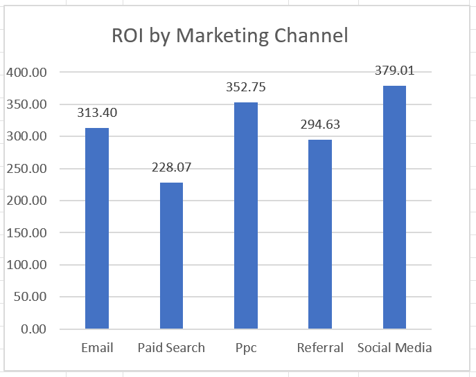
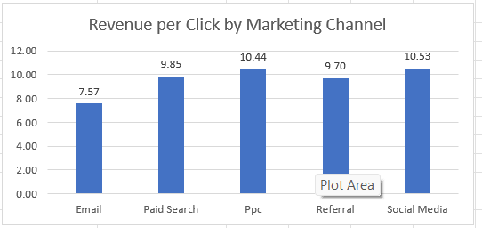
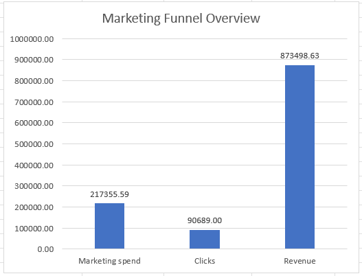

# SCT_DA_4 – Marketing Campaign Performance Analysis

## Task Overview

This project analyzes marketing campaign performance using exploratory data analysis (EDA), channel-level performance metrics, marketing funnel visualization, and ROI comparison.

## Dataset

The dataset contains marketing campaign records with information on:

- Campaign ID
- Date
- Marketing Channel
- Spend
- Clicks
- Revenue
- ROI

The dataset covers campaigns from January 2023 to January 2024.

## Analysis Performed

The analysis included:

- Data inspection and cleaning
- Exploratory data analysis
- Marketing spend, clicks, and revenue analysis
- ROI calculation by marketing channel
- Revenue per click comparison
- Revenue and spend share comparison
- Marketing funnel/performance overview
- Historical channel performance comparison for budget planning

## Key Results

- Total campaigns: **88**
- Total marketing spend: **₹217,355.59**
- Total revenue: **₹873,498.63**
- Total clicks: **90,689**
- Overall ROI: **301.88%**

Among the named marketing channels:

- **Social Media** recorded the highest ROI at **379.01%** and the highest revenue per click at **₹10.53**.
- **PPC** recorded **352.75% ROI** and generated the largest share of total revenue at **27.02%**.
- **Paid Search** recorded the lowest ROI among the named channels at **228.07%**.

## Budget Recommendation

Based on the historical results in this dataset, Social Media and PPC showed the strongest combination of ROI and revenue contribution. Future test budgets could consider these channels while continuing to monitor performance.

Paid Search could be reviewed before increasing its allocation because its spend share exceeded its revenue share and it had the lowest ROI among the named channels.

These observations are based on historical campaign performance and do not guarantee future results.

## Data Note

The dataset contained **5 campaign records with missing Marketing_channel values**. These records were retained in the overall dataset totals but excluded from named-channel comparisons and budget recommendations. No marketing-channel values were invented or assigned.

## Files Included

- `Task4_Business_Insights_Report.docx` – Business Insights Report
- `[your Excel filename]` – Analysis workbook containing calculations, PivotTable, and charts
- `README.md` – Project documentation

## Tools Used

- Microsoft Excel
- Microsoft Word
- GitHub

## Visualizations

### ROI by Marketing Channel

### Revenue per Click by Marketing Channel

### Marketing Funnel Overview

